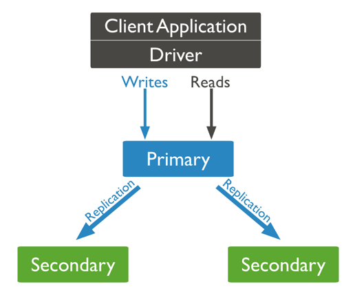

 
primary와 secondary, 그리고 읽기 설정 
<!--more-->

# Replica Set
레플리카셋은 mongod 프로세스들의 그룹이고, 여분의 데이터와 고가용성을 제공한다. primary가 사용 불가해졌을 때 여분의 데이터를 위해 멤버는 3 이상을 권장한다.
레플리카셋은 50개까지 늘릴 수 있고, 그 중 투표는 7개만 참여 가능하다. 둘만 남았을 때 투표가 불가하기 때문에, arbiter(투표만 하고 데이터를 저장하지 않음)를 사용할 수 있다.
- Primary
  - 레플리카 셋에서 쓰기를 받는 유일한 멤버다.
  - Mongodb는 primary에 쓰기를 적용하고 primary의 oplog에 기록한다.
  - Secondary는 그 로그를 복제해 그들의 데이터셋에 적용한다.
- Secondary
  - Secondary는 위 로그를 복제해 primary의 카피 데이터셋을 유지한다.

## Read Concern
일관성과 고립성 (ACID 중 C, I)을 유지시켜준다.
- local
  - 대부분의 레플리카셋 멤버들에게 쓰여졌는지 보증할 수 없다. primary, secondary를 읽을 때 기본 값
- available:
  - 위와 동일하나 consistent session, 트랜잭션과 함께 사용할 수는 없다.
- majority: 대다수의 레플리카셋 멤버에게 인정받은 데이터를 리턶나다.

## Read Preference
Read preference는 mongodb 클라이언트가 레플리카셋 멤버 읽기 시 접근 방법을 묘사한다.
기본적으로 애플리케이션은 읽기를 할 때 레플리카 셋의 primary member를 향하지만, 클라이언트는 secondaries에 읽기를 보내도록 특정할 수 있다.
실시간으로 통계를 계산하는 쿼리(무거운 Read 쿼리)는 primary에 부하를 줄 수 있기 때문에, secondaryPreferred로 날리면 서비스가 더 안정적일 것으로 예상해, 무거운 쿼리는 secondary 옵션을 주고 있다.

- primary
  - 기본 모드. 모든 읽기는 최근 레플리카셋의 primary로 가고, primary 없을 경우 에러를 냄.
  - 읽기를 포함한 Multi-document transaction은 무조건 primary로 읽어야 하고, 해당 트랜잭션의 모든 수행은 같은 멤버에게 가야 한다.
- primaryPreferred
  - primary가 기본이지만 불가할 경우 secondary로 가는 옵션
  - maxStalenessSeconds value를 포함하면 마지막 쓰기를 통해 어떤 secondary가 가장 최신인지 확인한다.
- secondary
  - 모든 읽기는 레플리카셋의 secondary로 가고, secondary가 없을 경우 에러를 낸다.
- secondaryPreferred
  - 기본 secondary지만, secondary 멤버가 없을 경우 sharded cluster의 primary로 감
- nearest
  - 접근할 수 있는 레플리카셋 멤버에 랜덤으로 간다.
